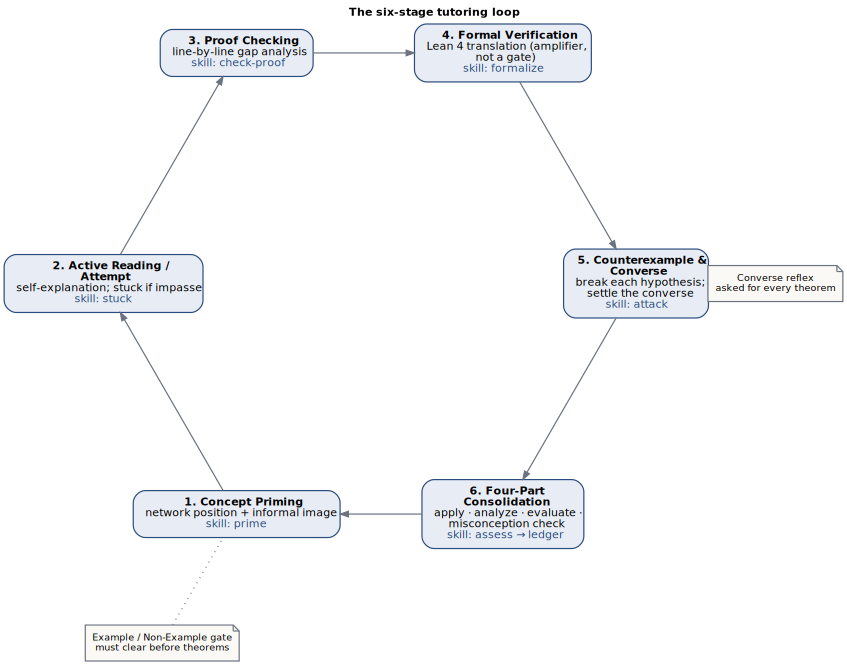
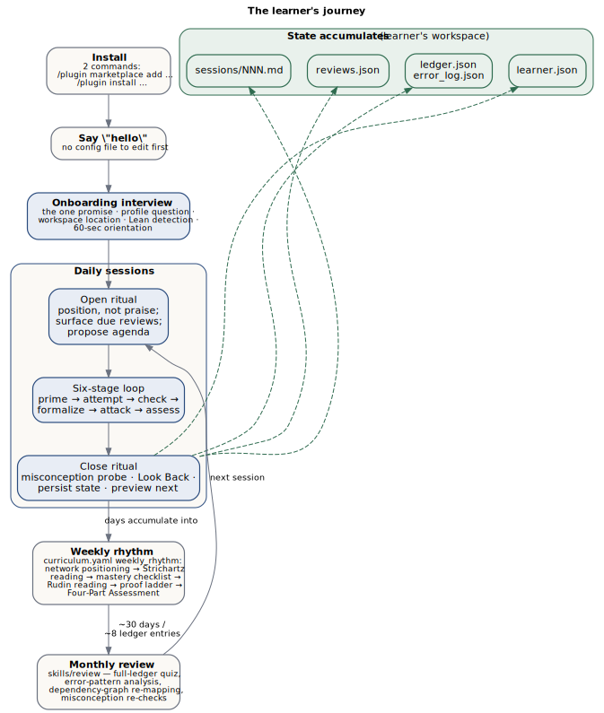

## What this is

`real-analysis-tutor` is a Claude Code plugin (`.claude-plugin/plugin.json`) that tutors
a learner through Real Analysis — Baby Rudin, Strichartz, and Alcock — using the V2.1
mastery methodology: Socratic questioning, misconception probing, a Theorem Ledger,
spaced review, and optional Lean 4 verification. It is Socratic by architecture: the
front-door skill (`skills/tutor/SKILL.md`) holds as its prime directive that the proof
must come from the learner, and it never supplies a proof, a partial proof, or a single
step of one (`skills/tutor/SKILL.md`, "Identity and prime directive").

**Author: Don Kearney.** The tutor system and the V2.1 methodology it operationalizes —
the *Real Analysis Complete Study Guide* ([Kearney, 2026](bibliography.qmd#ref-1)) and the *Low-Friction Setup & Workflow Guide* ([Kearney, 2026](bibliography.qmd#ref-2)),
vendored under `docs/source-guides/` — are Don Kearney's work and property (`README.md`,
`CHANGELOG.md` 2.1.0). The plugin implements that methodology as 10 skills, 5 agents,
and 3 hooks (`skills/`, `agents/`, `hooks/hooks.json`).

## Who this manual is for

This manual is for developers and curriculum authors, not learners. The learner-facing
guarantee stated in `README.md` under "That's it" is that a learner never needs to read
anything in this repository beyond the two install commands: the tutor introduces
itself, interviews the learner to pick a starting point, creates its own workspace, and
offers Lean 4 setup only when needed. `README.md` stays install-only by design; this
manual holds the "how" and "why" for anyone maintaining the plugin, auditing its
pedagogy, or porting it to a new subject.

## Quickstart

Two commands, run inside Claude Code (`README.md`):

```
/plugin marketplace add apollostream/real-analysis-tutor
/plugin install real-analysis-tutor@real-analysis-tutor
```

Then say hello. There is no third command and no configuration file to edit first.

## First run vs. returning sessions

On a first run — no `.ra-tutor-workspace` marker findable upward from the current
directory (`skills/tutor/SKILL.md`, "First-run branch") — the tutor runs the onboarding
interview in `skills/tutor/reference/onboarding.md`: it makes the one promise (never
hand over a proof), asks about proof experience to pick a `quick_start_profiles` entry
from `curriculum/real-analysis/curriculum.yaml`, asks where to keep the study workspace
(default `~/real-analysis-study`), and materializes it from `templates/workspace/`
before Stage 1. On later sessions it instead runs the open ritual in
`skills/tutor/reference/open-ritual.md`: reads saved state and due reviews through the
engine (`engine/state.py`, `engine/scheduler.py`), greets by progress rather than
praise, surfaces concepts due for review, and proposes an agenda before handing off to
the six-stage loop (`skills/tutor/reference/six-stage-loop.md`).

::: {.content-visible when-format="html"}
{#fig-six-stage-loop fig-alt="A cycle of six stages: Concept Priming (skill prime), Active Reading/Attempt (skill stuck on impasse), Proof Checking (skill check-proof), Formal Verification (skill formalize), Counterexample and Converse (skill attack), and Four-Part Consolidation (skills assess then ledger), returning to Concept Priming for the next topic. Annotated with the Example/Non-Example gate before Stage 1 and the converse reflex at Stage 5."}
:::
::: {.content-visible when-format="pdf"}
{#fig-six-stage-loop fig-alt="A cycle of six stages: Concept Priming (skill prime), Active Reading/Attempt (skill stuck on impasse), Proof Checking (skill check-proof), Formal Verification (skill formalize), Counterexample and Converse (skill attack), and Four-Part Consolidation (skills assess then ledger), returning to Concept Priming for the next topic. Annotated with the Example/Non-Example gate before Stage 1 and the converse reflex at Stage 5."}
:::

## The learner's journey

@fig-learner-journey traces the whole arc — from install to the
accumulating record of a semester's work. Two commands and a greeting
start it; every session after that opens with the tutor recalling saved
state, and every close ritual writes that state back to the workspace
files shown at the bottom of the figure.

::: {.content-visible when-format="html"}
{#fig-learner-journey fig-alt="Install (two plugin commands) leads to saying hello, then the onboarding interview, then daily sessions (open ritual, six-stage loop, close ritual) which accumulate into the weekly rhythm and, roughly every 30 days or 8 ledger entries, a monthly review, looping back into the next daily session. The close ritual writes learner.json, ledger.json/error_log.json, reviews.json, and sessions/NNN.md."}
:::
::: {.content-visible when-format="pdf"}
{#fig-learner-journey fig-alt="Install (two plugin commands) leads to saying hello, then the onboarding interview, then daily sessions (open ritual, six-stage loop, close ritual) which accumulate into the weekly rhythm and, roughly every 30 days or 8 ledger entries, a monthly review, looping back into the next daily session. The close ritual writes learner.json, ledger.json/error_log.json, reviews.json, and sessions/NNN.md."}
:::

## Map of this manual

- [Pedagogy](pedagogy.qmd) — the frameworks behind the tutoring loop: Solow, Pólya,
  Bloom, and Alcock, and how responsibility for each is divided across the plugin.
- [Architecture](architecture.qmd) — the three-layer design (deterministic engine,
  judgment-layer agents, fresh-context sessions), the hooks, and anti-leakage safeguards.
- [Generality](generality.qmd) — how much of the plugin is a general tutoring engine
  versus Real Analysis-specific curriculum, and where the hardwired seams are.
- [Extending](extending.qmd) — what a curriculum pack contains and what to edit to
  adapt the tutor to a new subject.
- [Reference](reference.qmd) — engine API signatures, hook contracts, workspace layout,
  Theorem Ledger fields, error categories, and curriculum YAML schemas.
- [FAQ](faq.qmd) — short, linked answers to the questions that come up most.
