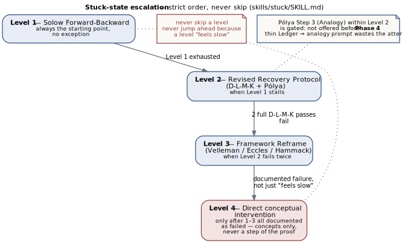

## Four frameworks, four jobs

The tutor draws on four pedagogical traditions, and each does a distinct job rather
than a redundant one. Bloom's taxonomy alone is wired into four separate mechanisms
in the codebase — not stated once in a prompt and hoped for, but load-bearing in a
plan, a gate, an assessment, and a stored field. The other three frameworks — Solow,
Pólya, and Alcock — each own a different dimension of the same session, mirroring the
division of labor set out in the source guide's Part III (`docs/source-guides/RealAnalysis_CompleteGuide_V2.1.md`).

## Bloom's taxonomy — four operative roles

**1. Per-reply calibration.** Before every pedagogical reply, `skills/tutor/SKILL.md`
("Hidden pre-response plan") requires a silent plan run in this order: diagnosis, then
"Bloom level + rung" — which cognitive level to target now and which proof-ladder rung
the position supports — then a withhold-list, then the one question actually asked.
This targets the failure mode the source guide names directly: AI tutors defaulting to
Remember and Understand forever (`curriculum/real-analysis/pedagogy/bloom.md`).

::: {.content-visible when-format="html"}
{#fig-bloom-ladder fig-alt="Five rungs in sequence — Mechanical (Remember/Understand), Structural (Apply), Conceptual (Analyze), Rudin-Style (Evaluate), Creative (Create) — with a gate between rungs 2 and 3 requiring rungs 1-2 fluent, and a gate between rungs 4 and 5 requiring rung 4 reliable."}
:::
::: {.content-visible when-format="pdf"}
{#fig-bloom-ladder fig-alt="Five rungs in sequence — Mechanical (Remember/Understand), Structural (Apply), Conceptual (Analyze), Rudin-Style (Evaluate), Creative (Create) — with a gate between rungs 2 and 3 requiring rungs 1-2 fluent, and a gate between rungs 4 and 5 requiring rung 4 reliable."}
:::

**2. Progression gating.** `curriculum/real-analysis/ladder.yaml` assigns each of the
five proof-ladder rungs a `bloom_levels` list — Rung 1 `[remember, understand]`, Rung 2
`apply`, Rung 3 `analyze`, Rung 4 `evaluate`, Rung 5 `create` — and states the gate
directly in the file: `"Rungs 1-2 fluent before 3; Rung 4 reliable before 5."` The
learner's Bloom level, in other words, controls which problems are offered next.

**3. Assessment structure.** `skills/assess/SKILL.md` runs the Four-Part Consolidation
Assessment, Bloom-indexed by construction: an applied problem targets Apply, a
conceptual/quantifier question targets Analyze, a derivation step targets Evaluate,
and the misconception check targets Analyze and Evaluate together. Each part is graded
0–5; a grade of 3 or higher on a part is what "demonstrates" its level, and the ladder
advances only on demonstrated mastery — the skill stops at the first level that fails
rather than averaging over a bad one.

**4. Persistent measurement.** `bloom_level` is one of the fourteen fields in
`curriculum/real-analysis/ledger-schema.yaml`, documented as "highest level achieved:
apply / analyze / evaluate / create," and `skills/assess/SKILL.md` sets it after
grading to the single highest level actually cleared that session. The same ≥3
threshold anchors `engine/scheduler.py`'s SM-2 review grades (a grade under 3 resets
the spacing interval). A test, `tests/test_curriculum.py::test_ledger_schema_matches_engine`,
asserts the schema's field list matches `engine.ledger.LEDGER_FIELDS` exactly, so the
two cannot silently drift apart. Session state — position (phase/chapter/rung),
per-concept mastery, and stuck counters — persists alongside it in `learner.json`
via `engine/state.py`, so Bloom level is a durable record, not something re-inferred
each session.

## Division of labor

The other three frameworks each answer a different question than "how deep should
this question go":

| Framework | Governs | Where it lives |
|---|---|---|
| **Solow** | Proof strategy — the forward/backward passes that structure how a definition or theorem gets interrogated before any proof attempt | `skills/prime/SKILL.md`; Stuck Level 1, `skills/stuck/reference/solow.md` |
| **Pólya** | Recovery — what to ask when the learner is stuck and needs a new approach, plus the Look Back that closes every proof | Stuck Level 2, `skills/stuck/reference/dlmk-polya.md`; Look Back in `skills/assess/SKILL.md` and `skills/tutor/SKILL.md` §7 |
| **Bloom** | Question calibration — pitching every question at a chosen cognitive level rather than defaulting to recall | `skills/tutor/SKILL.md` §2; `curriculum/real-analysis/ladder.yaml`; `skills/assess/SKILL.md`; `curriculum/real-analysis/ledger-schema.yaml` |
| **Alcock** | Reading and misconception research — the self-explanation protocol, the informal-image audit, and the misconception catalogue | `curriculum/real-analysis/pedagogy/self-explanation.md`; informal-image audit in `skills/prime/SKILL.md` §3; `curriculum/real-analysis/misconceptions.yaml` |

Solow and Pólya together drive `skills/stuck/SKILL.md`'s four-level escalation for a
learner who cannot make progress on a proof — strict order, never skip a level:

::: {.content-visible when-format="html"}
{#fig-stuck-escalation fig-alt="Level 1 Solow Forward-Backward always starts; escalates to Level 2 Revised Recovery Protocol (D-L-M-K plus Pólya) when Level 1 stalls; to Level 3 Framework Reframe when Level 2 fails twice; to Level 4 direct conceptual intervention only after Levels 1-3 all documented as failed, and even then concepts only, never a step of the proof. Annotated: never skip a level or jump ahead because a level feels slow; Pólya's analogy step within Level 2 is gated to not be offered before Phase 4."}
:::
::: {.content-visible when-format="pdf"}
{#fig-stuck-escalation fig-alt="Level 1 Solow Forward-Backward always starts; escalates to Level 2 Revised Recovery Protocol (D-L-M-K plus Pólya) when Level 1 stalls; to Level 3 Framework Reframe when Level 2 fails twice; to Level 4 direct conceptual intervention only after Levels 1-3 all documented as failed, and even then concepts only, never a step of the proof. Annotated: never skip a level or jump ahead because a level feels slow; Pólya's analogy step within Level 2 is gated to not be offered before Phase 4."}
:::

Alcock's contribution is concrete rather than a single technique: the self-explanation
protocol carries independence milestones (unprompted by Phase 3, automatic by Phase 5,
per `curriculum/real-analysis/pedagogy/self-explanation.md`); `skills/prime/SKILL.md`
runs an informal-image audit before the learner reads any formal definition; and the
misconception catalogue in `curriculum/real-analysis/misconceptions.yaml` is grounded
explicitly in the Weber–Mejía-Ramos ([Mejía-Ramos et al., 2012](bibliography.qmd#ref-19)) and Hodds–Alcock–Inglis ([2014](bibliography.qmd#ref-18)) research programs, per its
own header comment.

## What makes this explicit rather than aspirational

None of the above is a claim in a system prompt that the model is trusted to remember.
Each framework's rule lives in one of four concrete places: instruction text loaded at
the moment it applies — skill bodies and reference cards such as `skills/stuck/reference/solow.md`,
read only when that stuck level is actually reached; machine-checked data — `ladder.yaml`
and `ledger-schema.yaml`, whose shape a CI test enforces against the engine's own field
list; deterministic state the model cannot improvise away — `learner.json` and
`reviews.json`, written and read exclusively through `engine/state.py` and
`engine/scheduler.py`, never hand-computed; and a per-turn hook,
`hooks/scripts/prompt_guard.py`, which re-injects the Socratic contract — "diagnosis →
scaffolding level → what you will NOT reveal → your one question" — into
`UserPromptSubmit` on every single learner message, tier-escalating when the prompt
looks like it is fishing for an answer. The frameworks do not depend on the model
choosing to remember them; the architecture puts each one where it cannot be skipped.
